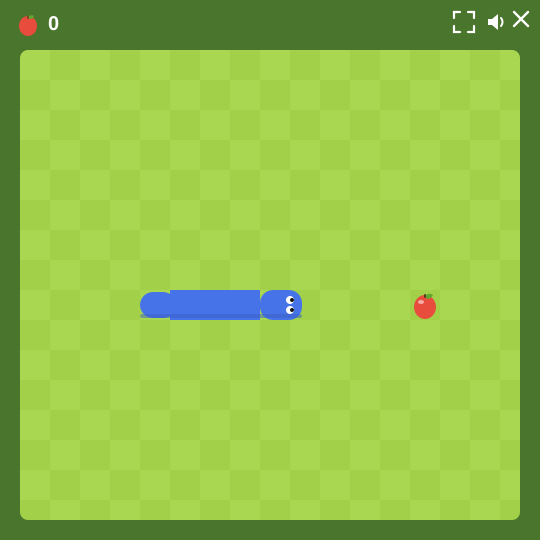
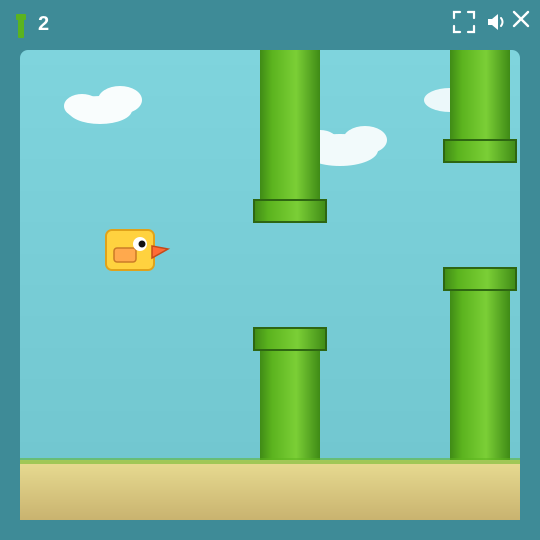

# 🐍 Python Tutorial

Two complete game projects, two skill levels. Pick where you are.

## 🟢 Beginner — Snake

Build the classic Snake game from scratch. You'll meet `print`,
variables, `input`, `if/else`, loops, lists, functions, and the
`turtle` graphics tool.

  

| | Class |
|---|---|
| 🔓 | [**1 — Make the computer talk**](./class-01/) (print) |
| 🔓 | [**2 — Remember things**](./class-02/) (variables) |
| 🔓 | [**3 — Ask the player**](./class-03/) (input) |
| 🔓 | [**4 — Make choices**](./class-04/) (if / else) |
| 🔓 | [**5 — Do it again**](./class-05/) (while loops) |
| 🔓 | [**6 — Open the green window**](./class-06/) (turtle) |
| 🔓 | [**7 — Draw the board**](./class-07/) (for loops) |
| 🔓 | [**8 — The snake's body**](./class-08/) (lists) |
| 🔓 | [**9 — Move with arrows**](./class-09/) (keys + loop) |
| 🔓 | [**10 — Tidy up**](./class-10/) (functions) |
| 🔓 | [**11 — The apple**](./class-11/) (random + growing) |
| 🔓 | [**12 — Game over!**](./class-12/) (collisions) |

## 🟡 Intermediate — Flappy Bird

Build the famous tap-to-flap arcade hit: a yellow bird, green pipes,
gravity, and a score that climbs the longer you survive. You'll
meet **classes**, methods, multiple instances, lists of objects,
collisions, game state, and dictionaries.

  

| | Class |
|---|---|
| 🔓 | [**1 — Open the sky**](./flappy/class-01/) (turtle review) |
| 🔓 | [**2 — The Bird blueprint**](./flappy/class-02/) (`class`, `__init__`, `self`) |
| 🔓 | [**3 — Gravity!**](./flappy/class-03/) (state mutation + game loop) |
| 🔓 | [**4 — Flap!**](./flappy/class-04/) (key bindings + bound methods) |
| 🔓 | [**5 — The first pipe**](./flappy/class-05/) (drawing rectangles) |
| 🔓 | [**6 — A real Pipe class**](./flappy/class-06/) (second class + scrolling) |
| 🔓 | [**7 — Many pipes**](./flappy/class-07/) (lists + `random`) |
| 🔓 | [**8 — Score!**](./flappy/class-08/) (attributes + HUD text) |
| 🔓 | [**9 — Don't crash!**](./flappy/class-09/) (collision detection) |
| 🔓 | [**10 — Game over**](./flappy/class-10/) (game state + restart) |
| 🔓 | [**11 — Best score**](./flappy/class-11/) (dictionaries) |
| 🔓 | [**12 — Polish**](./flappy/class-12/) (bird tilt + parallax ground) |

---

## 🚧 New, smaller-classes version (in progress)

We're rebuilding the Snake course into **65 smaller classes** —
one Python idea per class, about 10 minutes each. These are the
classes built so far:

| | Class |
|---|---|
| 🔓 | [**46 — Make it tick**](./class-46/) (`screen.ontimer`) |
| 🔓 | [**47 — Which way?**](./class-47/) (the `direction` box) |

The 12-class course above still works — keep using it until the
new course catches up.

---

## 💡 Three big tips

- ✍️ **Type the code yourself.** Don't copy-paste. Typing helps your
  brain remember.
- 🛑 **Errors are okay.** Red messages aren't scary — they're clues.
- 🔬 **Try stuff.** Change a number, change a word, see what happens.
  You can't break anything.
