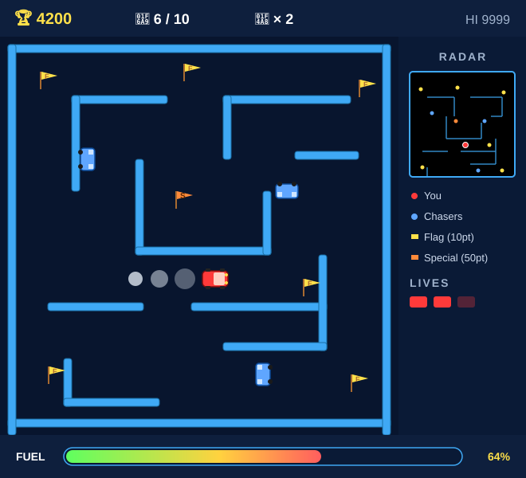

# 🐍 Python Tutorial

Two complete game projects, two skill levels. Pick where you are.

## 🟢 Beginner — Snake

Build the classic Snake game from scratch. You'll meet `print`,
variables, `input`, `if/else`, loops, lists, functions, and the
`turtle` graphics tool.

  

| | Class |
|---|---|
| 🔓 | [**1 — Make the computer talk**](./class-01/) (print) |
| 🔓 | [**2 — Remember things**](./class-02/) (variables) |
| 🔓 | [**3 — Ask the player**](./class-03/) (input) |
| 🔓 | [**4 — Make choices**](./class-04/) (if / else) |
| 🔓 | [**5 — Do it again**](./class-05/) (while loops) |
| 🔓 | [**6 — Open the green window**](./class-06/) (turtle) |
| 🔓 | [**7 — Draw the board**](./class-07/) (for loops) |
| 🔓 | [**8 — The snake's body**](./class-08/) (lists) |
| 🔓 | [**9 — Move with arrows**](./class-09/) (keys + loop) |
| 🔓 | [**10 — Tidy up**](./class-10/) (functions) |
| 🔓 | [**11 — The apple**](./class-11/) (random + growing) |
| 🔓 | [**12 — Game over!**](./class-12/) (collisions) |

## 🟡 Intermediate — Rally-X

Build a **Brawl-Stars-flavored arcade racer** through a maze:
collect flags, dodge chasers, drop a smoke screen, watch your fuel.
You'll meet **classes**, methods, multiple instances, dictionaries,
file I/O, and a touch of pathfinding.

  

| | Class |
|---|---|
| 🔓 | [**1 — Open the Rally-X window**](./rally-x/class-01/) (turtle review) |
| 🔓 | [**2 — The Car blueprint**](./rally-x/class-02/) (`class`, `__init__`, `self`) |
| 🔓 | [**3 — Many cars**](./rally-x/class-03/) (instances + lists) |
| 🔓 | [**4 — Build the maze**](./rally-x/class-04/) (list of tuples) |
| 🔓 | [**5 — Drive!**](./rally-x/class-05/) (arrow keys + game loop) |
| 🔓 | [**6 — Wall collisions**](./rally-x/class-06/) (`in` operator) |
| 🔓 | [**7 — Yellow flags**](./rally-x/class-07/) (Flag class + pickup) |
| 🔓 | [**8 — Enemy chasers**](./rally-x/class-08/) (simple AI) |
| 🔓 | [**9 — Fuel & lives**](./rally-x/class-09/) (dictionaries + HUD) |
| 🔓 | [**10 — Smoke screen**](./rally-x/class-10/) (cooldowns) |
| 🔓 | [**11 — Game over**](./rally-x/class-11/) (running flag + restart) |
| 🔓 | [**12 — Radar mini-map**](./rally-x/class-12/) (coordinate scaling) |

---

## 💡 Three big tips

- ✍️ **Type the code yourself.** Don't copy-paste. Typing helps your
  brain remember.
- 🛑 **Errors are okay.** Red messages aren't scary — they're clues.
- 🔬 **Try stuff.** Change a number, change a word, see what happens.
  You can't break anything.
